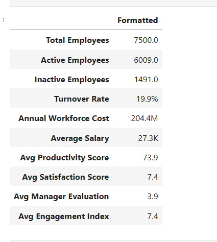
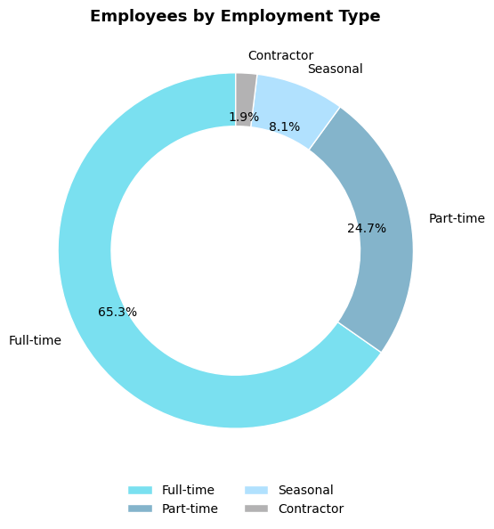
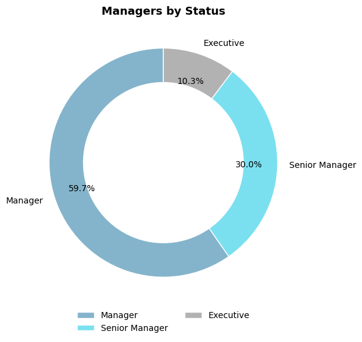
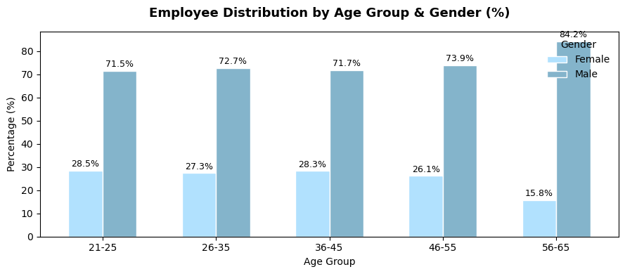
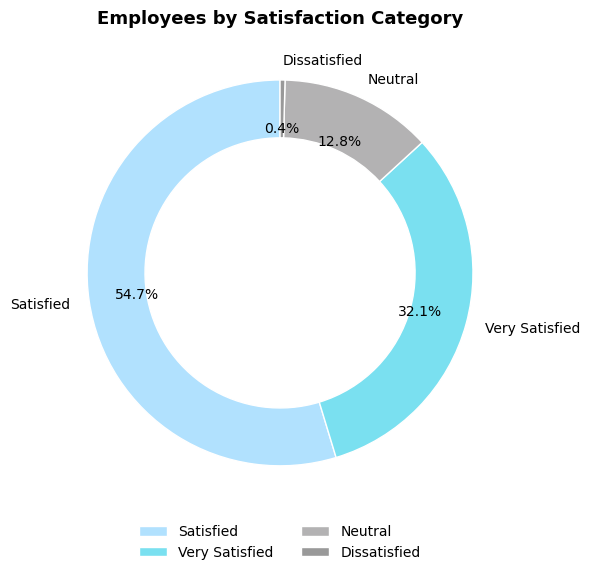
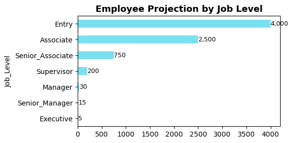
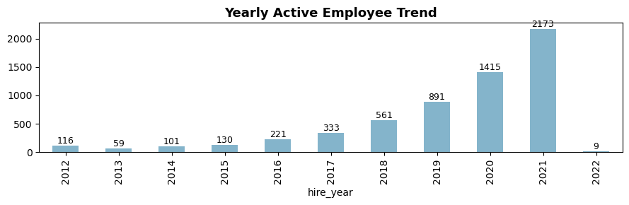
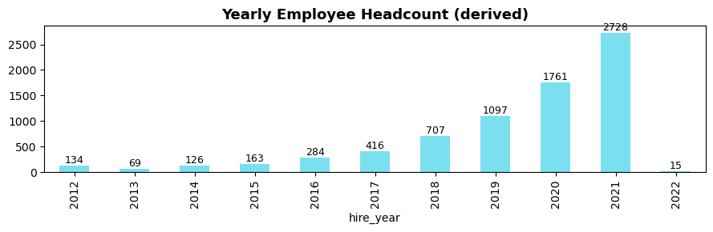
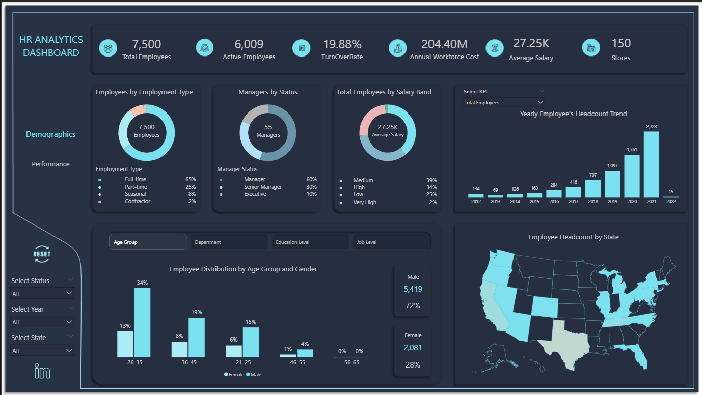
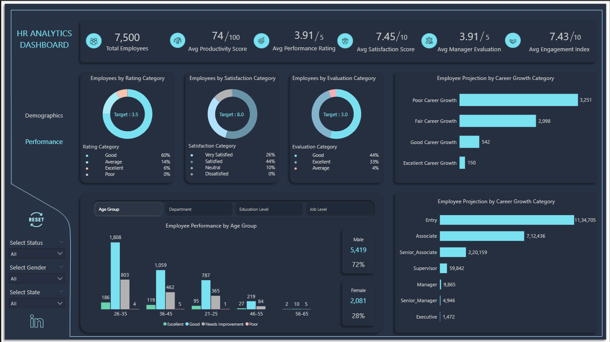

# 🧠 HR Analytics | Python, Power BI

This project focuses on **Exploratory Data Analysis (EDA)** of HR data using **Python (Pandas & Matplotlib)**, followed by an **interactive Power BI dashboard** for stakeholder-level insights.  
The objective is to analyze workforce demographics, attrition, satisfaction, and performance to support **data-driven HR decision-making**.

---

## 📊 Project Overview

The project follows a **two-step analytics approach**:

1. **Exploratory Data Analysis (EDA) using Python** to clean, analyze, and understand HR data patterns  
2. **Interactive Power BI Dashboard** to communicate insights through KPIs and visuals  

This approach mirrors real-world analytics workflows where **EDA precedes dashboarding**.

---

## 🧠 Business Objectives

- Perform **Exploratory Data Analysis (EDA)** on HR data  
- Track **employee headcount**, **active workforce**, and **turnover rate**  
- Analyze **demographic patterns** (age, gender, department, job level)  
- Evaluate **satisfaction**, **performance**, and **engagement** metrics  
- Calculate **workforce cost** and **average salary** insights  
- Present insights through **Power BI dashboards** for decision-makers  

---

## 🧾 Dataset Details

| Dataset File | Description |
|--------------|-------------|
| **Employees.xlsx** | Employee demographics, department, job level, and salary data |
| **Dim_monthly_performance.xlsx** | Monthly performance, manager evaluation, satisfaction, and engagement |
| **Calender.xlsx** | Date and time hierarchy for trend analysis |

📦 Datasets are stored in the **`Data/`** folder and used for both Python EDA and Power BI reporting.

---

## ⚙️ Tools & Technologies Used

| Tool | Purpose |
|------|--------|
| **Python (Pandas, Matplotlib)** | Exploratory Data Analysis, data cleaning, KPI calculation, visualization |
| **Power BI** | Data modeling, DAX measures, interactive dashboards |
| **Power Query** | Data transformation and relationships |
| **DAX** | KPI calculations (turnover, satisfaction, workforce cost) |

---

## 🐍 Python Exploratory Data Analysis (EDA)

The **Python notebook (`Python/HR_Analytics.ipynb`)** performs detailed **Exploratory Data Analysis (EDA)** to understand workforce structure, trends, and performance patterns before visualization.

### 🔹 EDA Activities
- Data loading and structure validation  
- Handling missing values and data consistency checks  
- Univariate and bivariate analysis  
- KPI calculation using Python  
- Visualization of trends and distributions  

### 🔹 Python Features
- Automated KPI generation  
- Bar, Donut, and Trend charts  
- Exported `.png` visuals for reporting  
- Power BI–style formatting for consistency  

---

## 🖼️ Python Visualization Preview

### **1️⃣ KPI Summary**
📊 Total Employees, Turnover Rate (%), Workforce Cost (M), Avg Salary (K)  

---

### **2️⃣ Employees by Employment Type**
🧩 Full-time, Part-time, Seasonal, Contractor  

---

### **3️⃣ Managers by Status**
👔 Manager, Senior Manager, Executive  

---

### **4️⃣ Employee Distribution by Age Group & Gender (%)**
📈 Gender distribution across age groups  

---

### **5️⃣ Employees by Satisfaction Category**
💬 Very Satisfied, Satisfied, Neutral, Dissatisfied  

---

### **6️⃣ Employee Projection by Job Level**
📊 Entry, Associate, Manager  

---

### **7️⃣ Yearly Active Employee Trend**
📅 Active workforce trend over time  

---

### **8️⃣ Yearly Employee Headcount (Derived)**
📅 Derived headcount trend  

---

## 💡 Key HR Insights (From EDA)

- 👥 **Total Employees:** 7,500  
- ✅ **Active Employees:** 6,009  
- 🔁 **Turnover Rate:** 19.9%  
- 💰 **Annual Workforce Cost:** 204.4M  
- 🧾 **Average Salary:** 27.3K  
- 💬 **86% employees** rated Satisfied or above  
- 🚀 **Consistent workforce growth** after 2017  

---

## 📊 Power BI Dashboard (Storytelling Layer)

After completing EDA, insights were translated into an **interactive Power BI dashboard** for HR stakeholders.

🔗 **[View Interactive Power BI Dashboard](https://app.powerbi.com/view?r=eyJrIjoiODNkYzBkYzAtNmY3MS00Yjc5LTllNTAtZmU2NjNkMGQ5ODg5IiwidCI6IjA2YzRkZTk4LTFlY2UtNDdiOC04OTI2LWNhYTAxOTU2MWQ1NyJ9)**

---

### **1️⃣ Demographics Page**
Focuses on workforce composition and trends:
- Employment type and manager status  
- KPIs: headcount, turnover, salary, workforce cost  
- Gender, age group, and regional analysis  
- Yearly headcount trends  

---

### **2️⃣ Performance Page**
Analyzes employee performance and engagement:
- Satisfaction and evaluation categories  
- Performance by job level and career projection  
- Satisfaction vs evaluation comparison  
- Departmental performance by gender and experience  

---

## 📈 Final Insights & Business Impact

- 🚀 Stable workforce growth since 2017  
- 💬 Satisfaction and engagement strongly influence retention  
- 💼 Strong manager evaluation correlates with higher productivity  
- 📊 Turnover maintained below 20%  
- 👩‍💼 Balanced gender representation across job levels  

---

## 📬 Contact

**👤 Santhosh Babu S**  
🎯 *Data Analyst | Power BI | Python | SQL*  

📧 **Email:** santhoshbabus.analyst@gmail.com  
🔗 [LinkedIn](https://www.linkedin.com/in/santhoshbabus/) | [GitHub](https://github.com/santhoshbabu-analyst)
